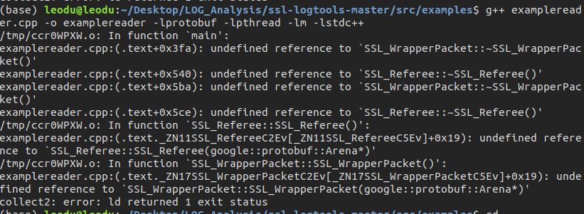

# LOG_Analysis
Robocup SSL LOG Analysis

To Do:

- [ ] LOG Split

  - Find useful log part(skip the referee time)

    - Official LOG:https://tigers-mannheim.de/download/gamelogs/ or https://mirror.robojackets.org/robocup-small-size-league/gamelogs/

    - LOG file format(Reference: https://github.com/RoboCup-SSL/ssl-logtools)

      Each log file starts with the following header:

      > 1: String - File type ("SSL_LOG_FILE")  
      > 2: Int32  - Log file format version  

      Format version 1 encodes the protobuf messages in the following format:

      > 1: Int64  - Receiver timestamp in ns  
      > 2: Int32  - Message type  
      > 3: Int32  - Size of binary protobuf message  
      > 4: String - Binary protobuf message  

      The message types are:

      > MESSAGE_BLANK           = 0 (ignore message) 
      > MESSAGE_UNKNOWN         = 1 (try to guess message type by parsing the data) 
      > MESSAGE_SSL_VISION_2010 = 2 
      > MESSAGE_SSL_REFBOX_2013 = 3 
      > MESSAGE_SSL_VISION_2014 = 4 

    - Read 

      Header->DataHeader->MessageType?->Message

      - Learn Protobuf

      - Protobuf format: Referee status judge:Command:Normal Start or Force Start

      - Problem:

        

        - g++ examplereader.cpp -o examplereader -lprotobuf -lpthread -lm -lstdc++

        - fuck! Problem Solved!

          Solution:ssl-logtools-master/src/examplereader/CMakeLists.txt last line delete